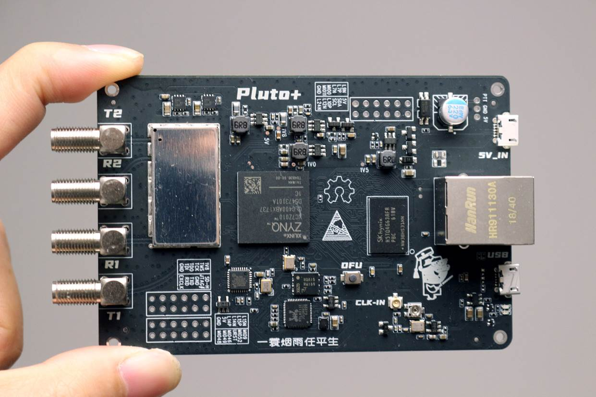
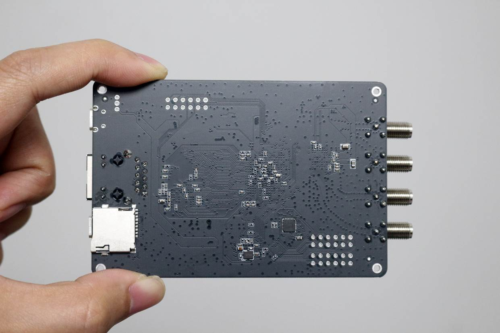
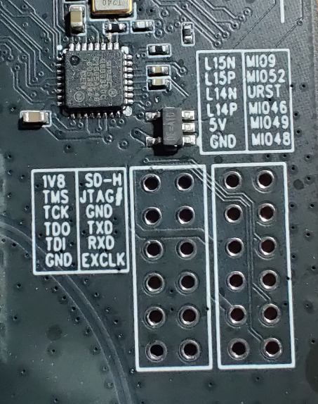
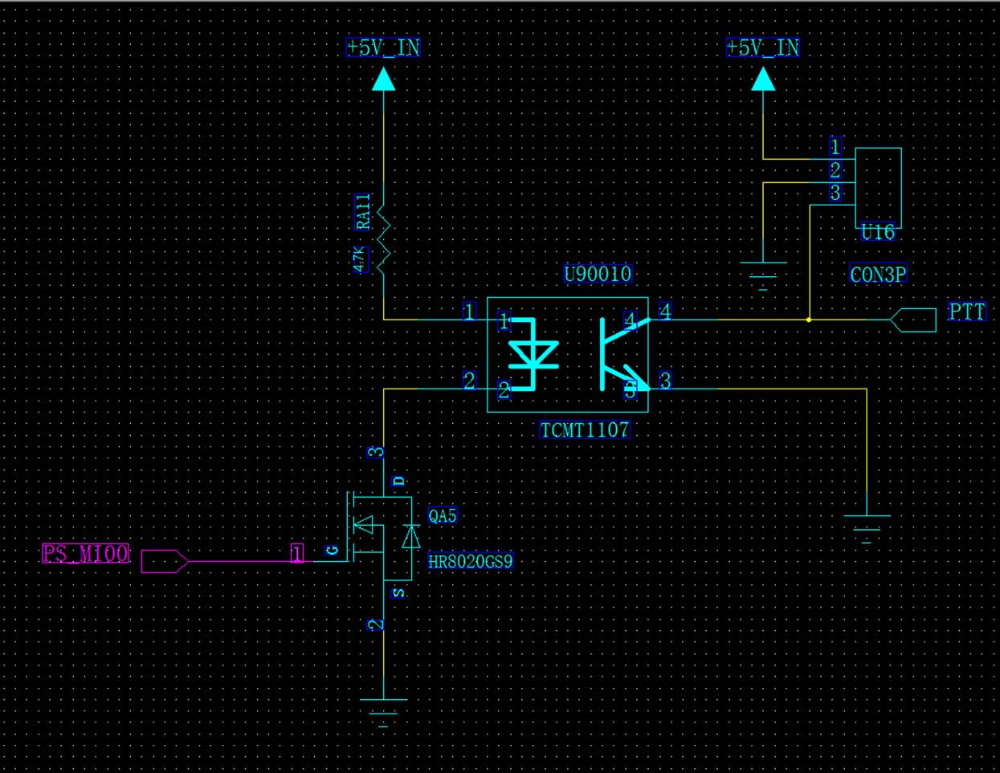
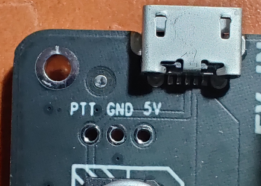
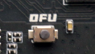
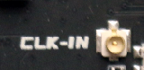
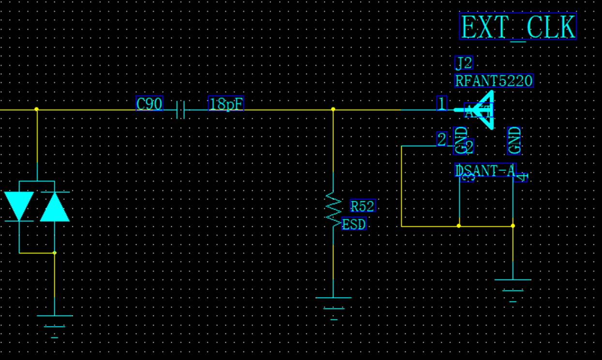

# Pluto+
The repo maintain the firmware of Pluto+. Pluto+ is a software-defined radio platform that supports 2TX 2RX, supports Gigabit Ethernet and Micro SD card. The design inherited from the well-known ADI ADALM-PLUTO with several improvements.

[TOC]

## Specification

| Feature     | Details                                                      |
| ----------- | ------------------------------------------------------------ |
| SOC         | Zynq7zc010 with 28k LUTs                                     |
| ADC/DAC     | AD9363(Can hack to AD9361 or AD9364)  with 2 Transmit, 2 Receive channel |
| RF Range    | 70MHZ~6GHZ                                                   |
| Ref Clock   | VCTCXO 40MHZ 0.5ppm, with external clock input               |
| RAM         | 512MB                                                        |
| FLASH       | 32MB, SD Card                                                |
| Connections | USB：2.0  support OTG                                        |
|             | Ethernet：1Gb                                                |
| DC IN       | 5V +-0.5V-2A microUSB                                        |





### Schematics

Pluto+ has full schematics open sourced. You can find this in sch folder.

[Download Schematics](./sch/PLUTOX_SDR-V1.0-20201212.pdf)

[Download Top View](./sch/Top.pdf)

[Download Bottom View](./sch/Bottom.pdf)

## How to upgrade the firmware

### UDisk Upgrade

1. You can download the latest firmware from here
2. Unzip the files
3. Put *.frm files into the storage disk named "PlutoSDR"

### DFU Upgrade
If you device is not responding anymore, you have to apply DFU procedure to unbrick it.
1. Download the firmware and unzip it. You can get them [here](https://github.com/analogdevicesinc/plutosdr-fw/).

2. Install dfu utility

5. Make Device enter DFU mode. There is a howto section below on the details steps.
   
4. Run DFU utility with the following command:

   ```
   dfu-tool -a 0 -write boot.dfu
   dfu-tool -a 1 -write pluto.dfu
   ```

## How to build firmware manually
1. Clone this repo
2. Download the source code via 'git submodule update --init'
3. Apply the diff to each subfolder
   ```
   cd plutosdr-fw
   git apply ../patches/fw.diff
   
   cd hdl
   git apply ../../hdl.diff
   cd ..
   
   cd linux
   git apply ../../linux.diff
   cd ..
   
   cd u-boot-xlnx
   git apply ../../u-boot-xlnx.diff
   cd ..
   
   ```
4. Build the code via 'make' in plutosdr-fw folder

In case you hit the error, please search the internet on PlutoSDR firmware build. It is identical.

## Jumpers and Pinouts

There is description on PCB on the jumpers.



*Please note that all IO levels are 1.8V.*

1. When using the official ADI-PlutoSDR firmware, please connect to URST-MI052.
2. When using Pluto+ firmware and need to support Ethernet, please connect URST-MIO46
3. When using SD card to boot, please connect SD-H to 1V8
4. When using JTAG to debug, please connect JTAG# to GND
5. Please connect EXCLK to GND when using external reference clock input

## HowTo

### How to connect PTT

PTT drives optocouplers through GPIO0 (MI00), which requires an external relay or control circuit.





### How to Enter DFU

1. Remove the screws and open up the device.
2. Short URST with MIO52, see the Jumper images for details.
3. Press DFU while power the device



### How to have a external reference clock

You can connect a cable to input an external high-precision reference clock for AD9363 through the IPEX interface.
The main level should not exceed **3.3V**, and the EXCLK jumper needs to be connected to GND to turn off the built-in clock. (Check Jumper image for details)





### How to Calibrate the OSC

The frequency of the 40M clock can be fine-tuned by adjusting the adjustable resistor next to the VCTCXO. You need to have a reference signal source and frequency meter when adjusting.

### How to boot from SD Card

Connect SD-H jumper to 1V8. Check Jumper image for details. We don't have SD image yet. And we will support it later.